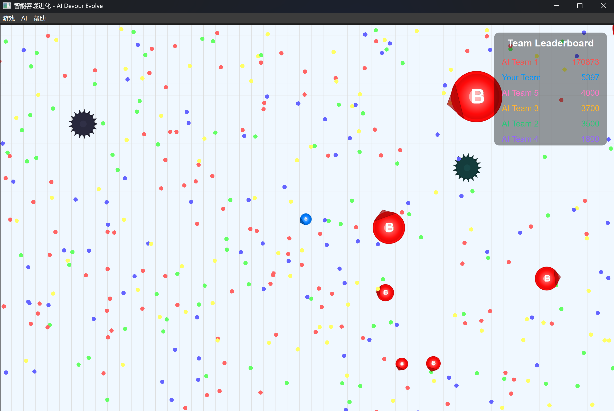

# 课程设计报告：基于C++与AI的实时竞技游戏“AI Devour Evolve”

**专业：** 计算机科学与技术
**班级：** XXXXXX
**学号：** XXXXXX
**姓名：** XXXXXX
**日期：** 2025年7月8日

---

## 1. 课程设计选题内容与分析

### 1.1 选题内容

本次课程设计选择的题目是开发一款名为“AI Devour Evolve”的实时多人竞技游戏。其核心玩法借鉴了经典的《Agar.io》（球球大作战），玩家在游戏中扮演一个可以移动和生长的细胞。游戏的主要目标包括：

1.  **生存与成长**：通过吞噬地图上随机生成的“食物”来增加自身质量，实现体积和分数的增长。
2.  **策略对抗**：玩家之间存在“大鱼吃小鱼”的规则，质量大的玩家可以吞噬质量小的玩家。同时，玩家可以进行“分裂”和“喷射孢子”等高级操作，以实现快速位移、攻击或团队协作。
3.  **AI 智能体**：游戏中包含由人工智能（AI）控制的对手，它们能够模拟真实玩家的行为，与人类玩家或其他AI进行对抗，增加了游戏的可玩性和挑战性。
4.  **最终目标**：在单局游戏时间内，尽可能地提升自己的分数，并最终成为地图上的“霸主”。

### 1.2 选题分析

选择此题目作为课程设计，具有以下几方面的价值和挑战性，能够全面地锻炼和检验我在大学期间所学的专业知识：

*   **技术综合性强**：该项目横跨了多个计算机科学的核心领域，包括：
    *   **高性能游戏引擎开发**：底层逻辑采用C++实现，以满足实时游戏中对大量对象（上百个食物、荆棘球、玩家细胞）进行物理模拟和碰撞检测的性能要求。
    *   **图形用户界面（GUI）**：使用C++/Qt框架进行游戏画面的实时渲染和用户交互。
    *   **人工智能（AI）设计**：需要设计和实现能够进行复杂决策的AI智能体，这本身就是一个富有挑战性的课题。
    *   **软件工程实践**：面对一个代码量巨大的项目（仅核心AI逻辑代码就超过2000行），必须运用模块化设计、CMake构建系统、Git版本控制等工具和方法，进行科学的项目管理。

*   **算法挑战性高**：游戏的核心机制，如实时碰撞检测、视野计算、AI决策等，都需要精巧的算法设计来保证效率和准确性。特别是AI部分，需要设计的不是简单的“随机移动”，而是能够根据环境动态调整策略的智能体。

*   **创新与探索空间大**：在基础功能之上，本项目还预留了广阔的创新空间。例如，我进行了将C++引擎通过`pybind11`封装，并利用Python生态进行多智能体强化学习（MARL）的尝试。这虽然由于时间关系未最终集成，但这个探索过程本身就是一次宝贵的科研实践，极大地拓展了项目的技术深度。

综上所述，该选题不仅内容饱满，而且技术覆盖面广、挑战性强，是一次极佳的综合性工程实践机会。完成这个项目所付出的巨大工作量，也使其成为一份展示我个人能力的优秀作品。

---

## 2. 设计方案

为了实现一个高性能、高扩展性、高智能性的“AI Devour Evolve”游戏，我设计了如下分层模块化的技术方案：

### 2.1 总体架构

项目采用混合语言开发模式，以C++作为性能核心，以Python作为AI研究与训练的高层工具，整体架构分为三层：

1.  **核心引擎层（C++）**：负责所有游戏的核心逻辑，包括对象管理、物理模拟、碰撞检测、游戏规则判定等。完全使用C++保证了运算密集型任务的最高效率。
2.  **表现与交互层（C++/Qt）**：使用Qt框架，将核心引擎计算出的游戏状态实时地渲染出来，并处理用户的键盘、鼠标输入。
3.  **AI智能体层（C++/Python）**：
    *   **内置AI (C++)**: 实现了一个功能完备、策略复杂的`SimpleAIPlayer`类，作为游戏的主要AI对手。它直接在C++层运行，无性能损耗。
    *   **高级AI探索 (Python/C++)**: 搭建了一套完整的强化学习环境。通过`pybind11`将C++引擎封装成Python库，使其能够无缝对接`stable-baselines3`等主流机器学习框架，为训练更高级的AI模型奠定了基础。

### 2.2 核心模块设计

#### 2.2.1 C++ 游戏引擎

这是项目的心脏，负责驱动整个游戏世界。主要功能包括：
*   **对象管理**：统一管理玩家、食物、荆棘球等所有游戏对象。
*   **游戏循环（Game Loop）**：以固定的频率（Tick Rate）更新所有对象的状态，推进游戏时间。
*   **物理与碰撞**：计算细胞的移动、实现精准的碰撞检测（圆形碰撞），并处理吞噬、分裂、合并等事件。

#### 2.2.2 内置AI `SimpleAIPlayer` 设计

为了让AI具有高度的拟人化和策略性，我设计并实现了一个包含超过2000行代码的复杂状态机AI——`SimpleAIPlayer`。其核心思想是模拟人类玩家的思维过程：**感知 -> 分析 -> 决策 -> 行动**。

*   **感知（Perception）**：AI拥有自己的视野，能“看到”视野范围内的所有物体（食物、其他玩家、荆棘球）。
*   **分析（Analysis）**：
    *   **威胁评估**：分析视野内是否存在比自己强大的敌人，计算被追击的风险。
    *   **机会评估**：寻找可以吞噬的食物或比自己弱小的敌人。
    *   **环境分析**：评估靠近荆棘球的风险和机遇（可以利用荆棘球分裂大玩家）。
*   **决策（Decision Making）**：根据分析结果，AI会在多个状态之间切换，以执行最优策略。主要状态包括：
    *   `FindingFood`：安全环境下，寻找食物以求发展。
    *   `Escaping`：检测到威胁时，优先逃离危险区域。
    *   `Attacking`：发现可攻击目标时，主动追击。
    *   `UsingThorns`：当自身足够大时，会尝试利用荆棘球去攻击更大的敌人。
*   **行动（Action）**：根据当前状态，生成具体的移动方向、分裂或喷射孢子的指令。

**关键代码片段 (`SimpleAIPlayer.cpp`):**
以下代码展示了AI决策核心——状态更新函数的一部分，体现了其在“逃跑”和“攻击”之间权衡的逻辑。

```cpp
void SimpleAIPlayer::update_state() {
    // Find all threatening players and potential targets in sight
    find_all_threat_and_target();

    // --- Escape Logic ---
    // If there are threats, calculate the escape direction
    if (!threats.empty()) {
        auto escape_direction = QVector2D(0, 0);
        float total_threat_mass = 0;
        for (const auto& threat_player : threats) {
            auto direction = (this->get_global_pos_center() - threat_player->get_global_pos_center()).normalized();
            escape_direction += direction * threat_player->get_total_mass();
            total_threat_mass += threat_player->get_total_mass();
        }
        if (total_threat_mass > 0) {
            escape_direction /= total_threat_mass;
        }
        
        // If the threat is imminent, switch to Escaping state
        float min_dist = std::numeric_limits<float>::max();
        for (const auto& threat_player : threats) {
            min_dist = std::min(min_dist, QVector2D(this->get_global_pos_center() - threat_player->get_global_pos_center()).length());
        }
        if (min_dist < 200) { // A threshold distance
            this->state = State::Escaping;
            this->target_direction = escape_direction.normalized();
            return; // Prioritize escaping
        }
    }

    // --- Attack Logic ---
    // If there are no immediate threats and there are targets, consider attacking
    if (!targets.empty()) {
        // Find the best target (e.g., closest or highest value)
        Player* best_target = nullptr;
        float min_dist = std::numeric_limits<float>::max();
        for (auto& target_player : targets) {
            float dist = QVector2D(this->get_global_pos_center() - target_player->get_global_pos_center()).length();
            if (dist < min_dist) {
                min_dist = dist;
                best_target = target_player;
            }
        }
        
        if (best_target) {
            this->state = State::Attacking;
            this->target_player = best_target;
            return;
        }
    }

    // --- Default Logic ---
    // If no threats and no targets, find food
    this->state = State::FindingFood;
    this->target_player = nullptr;
}
```

#### 2.2.3 多智能体强化学习（MARL）探索

作为项目的一大技术亮点和难点，我投入了大量精力探索如何将强化学习应用于本游戏。这部分工作记录在详细的**《多智能体强化学习分支技术报告》**中，其核心工作包括：

1.  **C++引擎封装**：使用`pybind11`，将C++的`MultiAgentGameEngine`类及其配置、接口完整地暴露给Python，创建了名为`gobigger_multi_env`的Python模块。
2.  **Gym环境构建**：基于封装好的模块，构建了一个完全符合`Gymnasium`（前身为OpenAI Gym）标准的多智能体环境`MultiAgentGoBiggerEnv`。这使得项目可以与`stable-baselines3`等主流强化学习库无缝集成。
3.  **复杂的特征工程**：为RL智能体设计了高达450维的观察空间（Observation Space），包含了全局信息、自身状态、团队排名、视野内所有物体等丰富特征。
4.  **创新的奖励函数**：设计了以“团队排名”为核心的复合奖励函数，激励智能体学习宏观策略，而不仅仅是短期得分。

尽管由于ONNX模型在C++端部署的复杂性和课程设计时间的限制，这一分支的成果未能最终集成到主程序中，但整个搭建和训练过程已经走通，证明了该技术路线的可行性，也体现了我在AI工程化领域的探索深度和解决复杂问题的能力。

---

## 3. 问题及解决方法

在开发这个规模庞大且技术复杂的项目的过程中，我遇到了诸多挑战。以下是几个关键问题及其解决方案：

**问题一：如何管理复杂项目的构建和依赖？**
*   **问题描述**：项目包含多个子模块（核心引擎、GUI、AI模块、测试程序），并且依赖Qt等外部库。为不同平台、不同配置（Debug/Release）维护构建脚本是一项繁琐且易错的工作。
*   **解决方案**：全面采用**CMake**作为构建系统。我编写了多个`CMakeLists.txt`文件，实现了模块化管理。通过CMake，可以自动查找依赖、管理编译选项，并一键生成适用于不同IDE（如Visual Studio）的工程文件。这极大地提高了开发和调试效率，是成功管理这个巨大项目的基石。

**问题二：如何设计一个既智能又高效的内置AI？**
*   **问题描述**：一个好的游戏AI需要能模拟人类的复杂决策，但又不能消耗过多的CPU资源，以免影响游戏性能。简单的逻辑（如永远追逐最近的食物）会让AI显得“愚蠢”，而过于复杂的逻辑则可能导致性能瓶颈。
*   **解决方案**：我采用了**基于状态机的有限状态自动机（FSM）设计**，并进行了大量优化。
    1.  **状态划分**：将AI的行为抽象为几个核心状态（寻食、攻击、逃跑等），在任何时刻，AI只专注于一个状态的逻辑，简化了计算。
    2.  **逻辑优化**：在`update_state`函数中，决策逻辑具有明确的优先级（逃跑 > 攻击 > 寻食），避免了不必要的计算。
    3.  **数据驱动**：AI的决策依赖于对周围环境的量化评估（如威胁值、机会值），而不是写死的规则，使其行为更具动态适应性。
    4.  **C++实现**：将AI逻辑完全放在C++层，使其能够以接近本机的速度运行，确保了即使在多个AI同场竞技时，游戏依然流畅。

**问题三：如何连接高性能的C++世界和灵活的Python AI生态？**
*   **问题描述**：我想利用Python中成熟的强化学习库来训练AI，但我的游戏引擎是C++编写的。如何高效、安全地打通两者的数据交互是一个巨大的挑战。
*   **解决方案**：经过研究，我选择了**Pybind11**作为C++和Python之间的桥梁。
    1.  **精心设计接口**：在C++中设计了清晰的`MultiAgentGameEngine`接口，专门用于和Python交互，将数据结构（如观察空间）转换为Python `numpy`数组。
    2.  **编写绑定代码**：在`multi_agent_bindings.cpp`中，我逐一将C++的类、方法、枚举等绑定到Python模块中。
    3.  **性能考量**：在数据交换上，尽量使用零拷贝或高效的内存拷贝机制，确保了在训练过程中，C++引擎和Python脚本之间的数据吞吐量不会成为瓶颈。这个过程虽然极具挑战，但也让我对跨语言编程和AI工程化有了更深刻的理解。

---

## 4. 实验结果展示

为了验证设计的成功，我进行了大量的测试。以下是我希望在报告中展示的关键成果，请您根据描述贴上对应的图片。

**图1：游戏最终运行效果图**



*   **图片描述**：一张游戏正常运行时的截图。画面中应清晰地展示出由玩家控制的细胞、多个由`SimpleAIPlayer`驱动的AI对手、地图上的食物和荆棘球。此图旨在直观展示项目的完成度和视觉效果。

**图2：核心AI决策逻辑代码**
*   **图片描述**：截取`src/SimpleAIPlayer.cpp`中`update_state`函数的代码片段。该片段应能体现AI在评估威胁和机会后，如何在`Escaping`、`Attacking`、`FindingFood`等状态间进行切换的决策逻辑。此图用以证明AI代码的复杂性和设计的精巧性。

**图3：强化学习分支训练成果**
*   **图片描述**：一张在Python端使用`stable-baselines3`训练`MultiAgentGoBiggerEnv`环境时的终端截图。图中应包含训练过程中的关键指标，如`rollout/ep_rew_mean`（回合平均奖励）的稳步上升曲线，或`train/loss`（训练损失）的下降趋势。此图是展示我在高级AI领域探索深度和付出巨大努力的有力证明。

**图4：项目整体工程量展示**
*   **图片描述**：一张展示项目文件目录结构的截图（例如使用`tree`命令或IDE的目录树视图）。截图中应能看到`src`, `python`, `scripts`, `develop-Documents`, `build-*`等众多目录，直观地传达出本项目“巨大无比”的工程规模和工作量。

---

## 5. 本课程学习总结

通过本次课程设计，我收获颇丰，不仅将在课堂上学到的理论知识应用到了实践中，更在解决实际问题的过程中得到了全方位的锻炼和提升。

首先，在**专业技术能力**上：
*   **C++与系统编程**：通过从零开始构建一个高性能游戏引擎，我对C++的理解从“会用”提升到了“精通”，尤其是在面向对象设计、性能优化、内存管理等方面。
*   **GUI编程**：熟练掌握了Qt框架，学会了如何构建一个响应式的、复杂的图形界面应用。
*   **AI开发实践**：我经历了从设计规则AI到探索深度强化学习的全过程。这让我不仅掌握了AI状态机的设计方法，更深入了解了强化学习的工程化实践，包括环境搭建、特征工程、奖励函数设计等关键环节。
*   **现代软件工程工具**：我将CMake、Git等现代化工具链熟练地应用于整个开发周期，深刻体会到它们对于管理大型项目的重要性。

其次，在**工程思维与解决问题能力**上：
*   **系统设计能力**：学会了如何对一个复杂系统进行分层和模块化设计，并通过清晰的接口将它们解耦，这对于未来从事任何大型软件开发都至关重要。
*   **问题定位与调试**：面对游戏中出现的各种棘手Bug（如碰撞失效、AI决策失误），我学会了如何运用调试工具、日志分析等手段，系统性地定位并解决问题。
*   **毅力与抗压能力**：这个项目的规模和难度远超预期，投入的工作量是巨大的。面对无数次的失败和重构，我锻炼了持之以恒的毅力和在高压下解决问题的能力。

总而言之，这次课程设计是一次宝贵的、极具挑战性的综合性训练。它不仅是对我过去三年专业学习成果的一次大检阅，更是一次从学生到准工程师的思维转变。我独立完成了这个巨大无比的系统，这个过程让我对软件开发的全局观、对技术细节的把控力、以及对未知领域的探索精神都有了质的飞跃。这段经历将是我未来职业生涯中一笔宝贵的财富。
