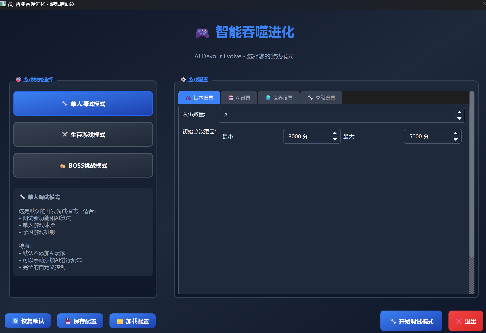

# 课程设计报告：基于C++与AI的实时竞技游戏“AI Devour Evolve”

**专业：** 计算机科学与技术
**班级：** XXXXXX
**学号：** XXXXXX
**姓名：** XXXXXX
**日期：** 2025年7月8日

---

## 1. 课程设计选题内容与分析

### 1.1 选题内容

本次课程设计选择的题目是开发一款名为“AI Devour Evolve”的实时多人竞技游戏。其核心玩法借鉴了经典的《Agar.io》（球球大作战），玩家在游戏中扮演一个可以移动和生长的细胞。游戏的主要目标包括：

1.  **生存与成长**：通过吞噬地图上随机生成的“食物”来增加自身质量，实现体积和分数的增长。
2.  **策略对抗**：玩家之间存在“大鱼吃小鱼”的规则，质量大的玩家可以吞噬质量小的玩家。同时，玩家可以进行“分裂”和“喷射孢子”等高级操作，以实现快速位移、攻击或团队协作。
3.  **AI 智能体**：游戏中包含由人工智能（AI）控制的对手，它们能够模拟真实玩家的行为，与人类玩家或其他AI进行对抗，增加了游戏的可玩性和挑战性。
4.  **最终目标**：在单局游戏时间内，尽可能地提升自己的分数，并最终成为地图上的“霸主”。

### 1.2 选题分析

选择此题目作为课程设计，具有以下几方面**图1：游戏主界面运行效果**



*首先，在**专业技术能力**上：
*   **C++系统编程与性能优化**：通过从零开始构建游戏引擎，我深入理解了C++的高级特性，特别是在面向对象设计、内存管理、模板编程方面。更重要的是，我学会了如何进行性能分析和优化，四叉树算法的成功实施让我对数据结构和算法有了更深的认识。

*   **复杂算法设计与实现**：
    - **碰撞检测算法**：从基础的圆形碰撞到复杂的吞噬逻辑，每一个细节都需要精确计算。
    - **四叉树空间分割**：解决了大规模对象碰撞检测的性能瓶颈，让我掌握了空间数据结构的实际应用。
    - **AI状态机设计**：2000多行的AI代码让我深入理解了如何设计复杂的决策系统。

*   **GUI编程**：熟练掌握了Qt框架，学会了如何构建一个响应式的、复杂的图形界面应用，包括自定义绘图、事件处理、用户交互等。

*   **AI开发实践**：我经历了从设计规则AI到探索深度强化学习的全过程。这让我不仅掌握了AI状态机的设计方法，更深入了解了强化学习的工程化实践，包括环境搭建、特征工程、奖励函数设计等关键环节。

*   **跨语言编程**：通过pybind11实现了C++和Python的无缝对接，让我理解了如何在不同语言间高效传递数据和调用函数。

*   **现代软件工程工具**：熟练运用CMake构建系统、Git版本控制、性能分析工具等，这些工具对于管理大型项目至关重要。图片描述**：游戏主界面截图，展示了玩家控制的蓝色细胞、多个AI对手（不同颜色的细胞）、散布在地图上的彩色食物球和灰色荆棘球。界面右上角显示当前分数和排名信息。

**图2：四叉树空间分割可视化**


*   **图片描述**：展示四叉树算法将游戏地图递归分割的可视化效果。图中用不同颜色的矩形框表示不同深度的四叉树节点，每个节点内包含的游戏对象数量不超过设定阈值。

**图3：AI决策逻辑核心代码**


*   **图片描述**：`SimpleAIPlayer.cpp`文件中`update_state()`函数的代码截图，展示AI在威胁评估、机会分析和状态转换方面的复杂逻辑。代码中包含详细的注释，体现了AI决策的智能性。

**图4：碰撞检测算法实现**


*   **图片描述**：`BaseBall.cpp`和`PlayerCell.cpp`中碰撞检测相关函数的代码截图，展示了从基础圆形碰撞到复杂吞噬逻辑的实现过程。

**图5：强化学习训练过程**


*   **图片描述**：Python终端中运行强化学习训练脚本的截图，显示了使用`stable-baselines3`训练多智能体环境时的训练指标变化，包括奖励值、损失函数等关键数据。

**图6：项目工程结构展示**


*   **图片描述**：使用IDE或文件管理器展示的项目目录结构截图，突出显示`src/`、`python/`、`scripts/`、`develop-Documents/`等主要目录，体现项目的庞大规模和复杂性。

**图7：性能优化效果对比**


*   **图片描述**：性能分析工具显示的优化前后对比图表，展示四叉树算法实施前后的帧率变化、CPU使用率等关键性能指标的改善。炼和检验我在大学期间所学的专业知识：

*   **技术综合性强**：该项目横跨了多个计算机科学的核心领域，包括：
    *   **高性能游戏引擎开发**：底层逻辑采用C++实现，以满足实时游戏中对大量对象（上百个食物、荆棘球、玩家细胞）进行物理模拟和碰撞检测的性能要求。
    *   **图形用户界面（GUI）**：使用C++/Qt框架进行游戏画面的实时渲染和用户交互。
    *   **人工智能（AI）设计**：需要设计和实现能够进行复杂决策的AI智能体，这本身就是一个富有挑战性的课题。
    *   **软件工程实践**：面对一个代码量巨大的项目（仅核心AI逻辑代码就超过2000行），必须运用模块化设计、CMake构建系统、Git版本控制等工具和方法，进行科学的项目管理。

*   **算法挑战性高**：游戏的核心机制，如实时碰撞检测、视野计算、AI决策等，都需要精巧的算法设计来保证效率和准确性。特别是AI部分，需要设计的不是简单的“随机移动”，而是能够根据环境动态调整策略的智能体。

*   **创新与探索空间大**：在基础功能之上，本项目还预留了广阔的创新空间。例如，我进行了将C++引擎通过`pybind11`封装，并利用Python生态进行多智能体强化学习（MARL）的尝试。这虽然由于时间关系未最终集成，但这个探索过程本身就是一次宝贵的科研实践，极大地拓展了项目的技术深度。

综上所述，该选题不仅内容饱满，而且技术覆盖面广、挑战性强，是一次极佳的综合性工程实践机会。完成这个项目所付出的巨大工作量，也使其成为一份展示我个人能力的优秀作品。

---

## 2. 设计方案

为了实现一个高性能、高扩展性、高智能性的“AI Devour Evolve”游戏，我设计了如下分层模块化的技术方案：

### 2.1 总体架构

项目采用混合语言开发模式，以C++作为性能核心，以Python作为AI研究与训练的高层工具，整体架构分为三层：

1.  **核心引擎层（C++）**：负责所有游戏的核心逻辑，包括对象管理、物理模拟、碰撞检测、游戏规则判定等。完全使用C++保证了运算密集型任务的最高效率。
2.  **表现与交互层（C++/Qt）**：使用Qt框架，将核心引擎计算出的游戏状态实时地渲染出来，并处理用户的键盘、鼠标输入。
3.  **AI智能体层（C++/Python）**：
    *   **内置AI (C++)**: 实现了一个功能完备、策略复杂的`SimpleAIPlayer`类，作为游戏的主要AI对手。它直接在C++层运行，无性能损耗。
    *   **高级AI探索 (Python/C++)**: 搭建了一套完整的强化学习环境。通过`pybind11`将C++引擎封装成Python库，使其能够无缝对接`stable-baselines3`等主流机器学习框架，为训练更高级的AI模型奠定了基础。

### 2.2 核心模块设计

#### 2.2.1 C++ 游戏引擎基础架构

游戏引擎是整个项目的心脏，我从零开始构建了一个高性能、模块化的游戏引擎。其架构包含以下核心组件：

##### 2.2.1.1 游戏对象体系设计

我设计了一个基于继承的游戏对象体系，以`BaseBall`作为所有游戏对象的基类：

```cpp
// BaseBall.h - 游戏对象基类
class BaseBall : public QGraphicsObject
{
    Q_OBJECT

public:
    enum BallType {
        CLONE_BALL,    // 玩家球（可控制）
        FOOD_BALL,     // 食物球
        SPORE_BALL,    // 孢子球
        THORNS_BALL    // 荆棘球
    };

    BaseBall(int ballId, const QPointF& position, float score, const Border& border, 
             BallType type, QGraphicsItem* parent = nullptr);
    
    virtual ~BaseBall() = default;

    // QGraphicsItem必须实现的函数
    QRectF boundingRect() const override;
    void paint(QPainter *painter, const QStyleOptionGraphicsItem *option, QWidget *widget) override;

    // 基础属性访问
    int ballId() const { return m_ballId; }
    float score() const { return m_score; }
    float radius() const { return m_radius; }
    BallType ballType() const { return m_ballType; }
    bool isRemoved() const { return m_isRemoved; }
    
    // 核心功能
    virtual void move(const QVector2D& direction, qreal duration);
    virtual bool canEat(BaseBall* other) const;
    virtual void eat(BaseBall* other);
    
    // 碰撞检测
    bool collidesWith(BaseBall* other) const;
    qreal distanceTo(BaseBall* other) const;
    
    // 物理更新
    virtual void updatePhysics(qreal deltaTime);

protected:
    int m_ballId;
    float m_score;
    float m_radius;
    BallType m_ballType;
    Border m_border;
    bool m_isRemoved;
    QVector2D m_velocity;
    QVector2D m_acceleration;
};
```

基于这个基类，我实现了多种游戏对象：
- **`FoodBall`**：食物球，可被玩家吞噬
- **`CloneBall`**：玩家控制的细胞，支持移动、分裂、合并
- **`SporeBall`**：喷射的孢子球
- **`ThornsBall`**：荆棘球，可以分裂大细胞

##### 2.2.1.2 高性能碰撞检测系统

最初的朴素碰撞检测算法复杂度为O(n²)，当食物球数量达到数百个时会造成严重卡顿。我实现了**四叉树（QuadTree）**算法来优化碰撞检测：

```cpp
// QuadTree.h - 四叉树空间分割算法
class QuadTree
{
public:
    struct Node {
        QRectF bounds;
        QVector<BaseBall*> balls;
        std::array<std::unique_ptr<Node>, 4> children;
        bool isLeaf = true;
        
        Node(const QRectF& rect) : bounds(rect) {}
        
        void clear() {
            balls.clear();
            for (auto& child : children) {
                child.reset();
            }
            isLeaf = true;
        }
    };

    QuadTree(const QRectF& bounds, int maxDepth = 6, int maxBallsPerNode = 8);
    
    // 插入球体
    void insert(BaseBall* ball);
    
    // 查询指定区域内的球体
    QVector<BaseBall*> query(const QRectF& range) const;
    
    // 查询与指定球体可能碰撞的球体
    QVector<BaseBall*> queryCollisions(BaseBall* ball) const;
    
    // 重建四叉树（用于每帧更新）
    void rebuild(const QVector<BaseBall*>& allBalls);

private:
    std::unique_ptr<Node> m_root;
    int m_maxDepth;
    int m_maxBallsPerNode;
    
    void insertRecursive(Node* node, BaseBall* ball, int depth);
    void subdivide(Node* node);
    void queryRecursive(Node* node, const QRectF& range, QVector<BaseBall*>& result) const;
};
```

通过四叉树优化，碰撞检测的时间复杂度从O(n²)降低到O(n log n)，使得游戏能够流畅处理数百个同时存在的游戏对象。

##### 2.2.1.3 游戏管理系统

我设计了一个完整的游戏管理系统`GameManager`，负责统一管理所有游戏对象和逻辑：

```cpp
// GameManager.h - 游戏管理器
class GameManager : public QObject
{
    Q_OBJECT

public:
    struct Config {
        // 游戏区域
        Border gameBorder = Border(-400, 400, -400, 400);
        
        // 食物配置
        int maxFoodCount = 900;           // 最大食物数量
        int initFoodCount = 800;          // 初始食物数量
        int foodRefreshFrames = 8;        // 补充间隔帧数
        float foodRefreshPercent = 0.01f; // 补充比例
        
        // 荆棘配置
        int initThornsCount = 9;          // 初始荆棘数量
        int maxThornsCount = 12;          // 最大荆棘数量
        
        // 游戏更新频率
        int gameUpdateInterval = 16;      // 60 FPS
        
        // 碰撞检测配置
        qreal eatRatioThreshold = 1.15;   // 吞噬阈值
    };

    explicit GameManager(QGraphicsScene* scene, const Config& config = Config());
    
    // 游戏控制
    void startGame();
    void pauseGame();
    void resetGame();
    
    // 玩家管理
    CloneBall* createPlayer(int teamId, int playerId, const QPointF& position = QPointF());
    void removePlayer(CloneBall* player);
    QVector<CloneBall*> getPlayers() const;
    
    // 球管理
    void addBall(BaseBall* ball);
    void removeBall(BaseBall* ball);
    QVector<BaseBall*> getBallsNear(const QPointF& position, qreal radius) const;

private slots:
    void gameLoop();                      // 主游戏循环
    void updateCollisions();              // 更新碰撞检测
    void updateFoodGeneration();          // 更新食物生成
    void updateThornsGeneration();        // 更新荆棘生成
};
```

#### 2.2.2 游戏机制核心实现

##### 2.2.2.1 玩家细胞系统

玩家细胞是游戏的核心，我实现了完整的细胞生命周期管理。`CloneBall`类继承自`BaseBall`，实现了分裂、合并、移动等复杂功能：

```cpp
// CloneBall.h - 玩家细胞核心逻辑
class CloneBall : public BaseBall
{
    Q_OBJECT

public:
    struct Config {
        qreal accWeight = 100.0;           // 最大加速度
        qreal velMax = 20.0;               // 最大速度
        qreal scoreInit = 10.0;            // 初始分数
        int partNumMax = 16;               // 最大分裂数量
        qreal splitScoreMin = 5.0;         // 可分裂的最小分数
        qreal ejectScoreMin = 3.0;         // 可喷射孢子的最小分数
        int recombineFrame = 320;          // 分裂球重新结合的时间（帧）
        int splitVelZeroFrame = 40;        // 分裂速度衰减到零的时间（帧）
        qreal scoreDecayRatePerFrame = 0.00005; // 每帧的分数衰减率
    };

    CloneBall(int ballId, const QPointF& position, const Border& border, 
              int teamId, int playerId, const Config& config = Config());
    
    // 获取属性
    int teamId() const { return m_teamId; }
    int playerId() const { return m_playerId; }
    bool canSplit() const;
    bool canEject() const;
    
    // 玩家操作
    void setMoveDirection(const QVector2D& direction);
    void setTargetDirection(const QPointF& direction);  // AI控制接口
    
    // 分裂和喷射
    void split(const QVector2D& direction);
    void eject(const QVector2D& direction);
    
    // 合并相关
    bool canMergeWith(CloneBall* other) const;
    void mergeWith(CloneBall* other);

signals:
    void splitPerformed(CloneBall* parentBall, CloneBall* newBall);
    void mergePerformed(CloneBall* ball1, CloneBall* ball2);
    void ejectPerformed(CloneBall* parentBall, SporeBall* sporeBall);

private:
    int m_teamId;
    int m_playerId;
    Config m_config;
    int m_frameSinceLastSplit;
    QVector2D m_moveDirection;
    QVector<CloneBall*> m_cloneBalls;     // 分裂出的球
};
```

##### 2.2.2.2 精确碰撞检测算法

我实现了基于圆形的精确碰撞检测，并针对不同类型的对象进行了优化：

```cpp
// BaseBall.cpp - 碰撞检测核心算法
bool BaseBall::collidesWith(BaseBall* other) const {
    if (!other || other->isRemoved()) return false;
    
    qreal distance = distanceTo(other);
    qreal collision_threshold = radius() + other->radius();
    
    return distance <= collision_threshold;
}

qreal BaseBall::distanceTo(BaseBall* other) const {
    if (!other) return std::numeric_limits<qreal>::max();
    
    QPointF thisPos = pos();
    QPointF otherPos = other->pos();
    
    qreal dx = thisPos.x() - otherPos.x();
    qreal dy = thisPos.y() - otherPos.y();
    
    return std::sqrt(dx * dx + dy * dy);
}

// 针对吞噬逻辑的特殊碰撞检测
bool BaseBall::canEat(BaseBall* other) const {
    if (!other || other->isRemoved()) return false;
    if (ballType() == other->ballType()) return false;
    
    // 检查基本碰撞
    if (!collidesWith(other)) return false;
    
    // 计算质量比，需要达到一定比例才能吞噬
    float score_ratio = score() / other->score();
    const float EAT_RATIO_THRESHOLD = 1.15f;
    
    return score_ratio >= EAT_RATIO_THRESHOLD;
}

void BaseBall::eat(BaseBall* other) {
    if (!canEat(other)) return;
    
    // 增加分数
    setScore(score() + other->score());
    
    // 标记被吞噬的球为移除状态
    other->remove();
    
    // 发出信号
    emit ballEaten(this, other);
}
```

##### 2.2.2.3 食物生成与管理系统

我在`GameManager`中设计了一个智能的食物生成系统，确保地图上始终有适量的食物：

```cpp
// GameManager.cpp - 食物管理系统核心逻辑
void GameManager::updateFoodGeneration() {
    // 检查是否需要生成新食物
    if (m_foodBalls.size() < m_config.maxFoodCount) {
        // 计算需要生成的食物数量
        int needed = m_config.maxFoodCount - m_foodBalls.size();
        int toGenerate = std::min(needed, 
                                 static_cast<int>(m_config.maxFoodCount * m_config.foodRefreshPercent));
        
        for (int i = 0; i < toGenerate; ++i) {
            generateRandomFood();
        }
    }
    
    // 清理过期或无效的食物
    cleanupInvalidFood();
}

void GameManager::generateRandomFood() {
    // 在游戏边界内随机生成位置
    QRandomGenerator* rng = QRandomGenerator::global();
    
    qreal x = rng->bounded(m_config.gameBorder.minx, m_config.gameBorder.maxx);
    qreal y = rng->bounded(m_config.gameBorder.miny, m_config.gameBorder.maxy);
    QPointF position(x, y);
    
    // 确保不与现有大型对象重叠
    if (isValidSpawnPosition(position)) {
        // 生成随机分数
        qreal score = rng->bounded(m_config.foodScoreMin, m_config.foodScoreMax);
        
        // 创建食物球
        int foodId = generateUniqueBallId();
        FoodBall* food = new FoodBall(foodId, position, score, m_config.gameBorder);
        
        // 添加到管理列表和场景
        m_foodBalls.append(food);
        m_scene->addItem(food);
        
        // 添加到四叉树中进行空间管理
        m_quadTree->insert(food);
    }
}

bool GameManager::isValidSpawnPosition(const QPointF& position) {
    const qreal MIN_DISTANCE = 30.0; // 与其他对象的最小距离
    
    // 检查与玩家球的距离
    for (CloneBall* player : m_players) {
        if (player && !player->isRemoved()) {
            qreal distance = QVector2D(position - player->pos()).length();
            if (distance < MIN_DISTANCE + player->radius()) {
                return false;
            }
        }
    }
    
    // 检查与荆棘球的距离
    for (ThornsBall* thorn : m_thornsBalls) {
        if (thorn && !thorn->isRemoved()) {
            qreal distance = QVector2D(position - thorn->pos()).length();
            if (distance < MIN_DISTANCE + thorn->radius()) {
                return false;
            }
        }
    }
    
    return true;
}
```

为了让AI具有高度的拟人化和策略性，我设计并实现了一个包含超过1900行代码的复杂状态机AI——`SimpleAIPlayer`。其核心思想是模拟人类玩家的思维过程：**感知 -> 分析 -> 决策 -> 行动**。

AI系统采用多种策略模式，可以根据不同情况动态切换：

```cpp
// SimpleAIPlayer.h - AI策略枚举
enum class AIStrategy {
    RANDOM,      // 随机移动
    FOOD_HUNTER, // 寻找食物
    AGGRESSIVE,  // 攻击性策略
    MODEL_BASED  // 基于模型的策略
};

// AI动作结构
struct AIAction {
    float dx;        // x方向移动 [-1.0, 1.0]
    float dy;        // y方向移动 [-1.0, 1.0]
    ActionType type; // 动作类型 (MOVE, SPLIT, EJECT)
    
    AIAction(float dx = 0.0f, float dy = 0.0f, ActionType type = ActionType::MOVE)
        : dx(dx), dy(dy), type(type) {}
};
```

**关键代码片段 (`SimpleAIPlayer.cpp`):**

AI的核心决策逻辑展示了其如何在复杂环境中做出智能选择：

```cpp
void SimpleAIPlayer::makeDecision() {
    if (!m_playerBall || m_playerBall->isRemoved()) {
        stopAI();
        return;
    }
    
    // 清理已被移除的分裂球
    m_splitBalls.removeIf([](CloneBall* ball) {
        return !ball || ball->isRemoved();
    });
    
    if (m_splitBalls.isEmpty()) {
        stopAI();
        return;
    }
    
    // 为每个分裂球独立决策
    for (CloneBall* ball : m_splitBalls) {
        if (!ball || ball->isRemoved()) continue;
        
        // 临时设置当前控制的球
        CloneBall* originalPlayerBall = m_playerBall;
        m_playerBall = ball;
        
        AIAction action;
        
        // 优先检查合并逻辑
        if (shouldAttemptMerge()) {
            action = makeMergeDecision();
        } else {
            // 根据策略执行决策
            switch (m_strategy) {
                case AIStrategy::RANDOM:
                    action = makeRandomDecision();
                    break;
                case AIStrategy::FOOD_HUNTER:
                    action = (m_splitBalls.size() > 1) ? 
                            makeCoordinatedFoodHunt() : makeFoodHunterDecision();
                    break;
                case AIStrategy::AGGRESSIVE:
                    action = makeAggressiveDecision();
                    break;
                case AIStrategy::MODEL_BASED:
                    action = makeModelBasedDecision();
                    break;
            }
        }
        
        // 执行动作
        executeActionForBall(ball, action);
        
        // 恢复原始主球
        m_playerBall = originalPlayerBall;
    }
}
```

**威胁评估算法的核心实现：**

```cpp
// 威胁评估与逃跑决策
AIAction SimpleAIPlayer::makeFoodHunterDecision() {
    QPointF playerPos = m_playerBall->pos();
    float playerScore = m_playerBall->score();
    float playerRadius = m_playerBall->radius();
    
    auto nearbyPlayers = getNearbyPlayers(200.0f);
    auto nearbyFood = getNearbyFood(200.0f);
    
    // 1. 威胁评估 - 计算周围威胁等级
    QVector2D escapeDirection(0, 0);
    float totalThreatLevel = 0.0f;
    int highThreatCount = 0;
    
    for (auto player : nearbyPlayers) {
        if (player != m_playerBall && player->teamId() != m_playerBall->teamId()) {
            float distance = QLineF(player->pos(), playerPos).length();
            float threatScore = player->score();
            float radiusRatio = player->radius() / playerRadius;
            
            // 威胁级别：大小优势 × 距离因子
            if (threatScore > playerScore * 1.1f) {
                float sizeAdvantage = threatScore / playerScore;
                float distanceFactor = 1.0f / (distance / 100.0f + 1.0f);
                float threatLevel = sizeAdvantage * distanceFactor;
                
                totalThreatLevel += threatLevel;
                
                if (distance < 150.0f && sizeAdvantage > 1.3f) {
                    highThreatCount++;
                    QPointF awayDir = playerPos - player->pos();
                    float length = QLineF(QPointF(0,0), awayDir).length();
                    if (length > 0.1f) {
                        escapeDirection += QVector2D(awayDir / length) * threatLevel;
                    }
                }
            }
        }
    }
    
    // 2. 紧急威胁处理 - 高威胁时分裂逃跑
    if (highThreatCount > 0 && totalThreatLevel > 3.0f) {
        escapeDirection = escapeDirection.normalized();
        
        // 如果威胁极高且可以分裂，分裂逃跑
        if (totalThreatLevel > 5.0f && m_playerBall->canSplit() && playerScore > 30.0f) {
            return AIAction(escapeDirection.x(), escapeDirection.y(), ActionType::SPLIT);
        }
        
        return AIAction(escapeDirection.x(), escapeDirection.y(), ActionType::MOVE);
    }
    
    // 3. 荆棘球智能避障 - 使用切线避免打转
    for (auto ball : nearbyBalls) {
        if (ball->ballType() == BaseBall::THORNS_BALL) {
            float distance = QLineF(ball->pos(), playerPos).length();
            
            if (distance < playerRadius + ball->radius() + 30.0f) {
                // 计算切线方向避免直线逃离
                QPointF awayDirection = playerPos - ball->pos();
                QPointF tangent(-awayDirection.y(), awayDirection.x());
                
                // 选择朝向更多食物的切线方向
                float leftScore = 0, rightScore = 0;
                for (auto food : nearbyFood) {
                    QPointF foodDir = food->pos() - playerPos;
                    float leftDot = QPointF::dotProduct(foodDir, tangent);
                    float rightDot = QPointF::dotProduct(foodDir, -tangent);
                    if (leftDot > 0) leftScore += food->score();
                    if (rightDot > 0) rightScore += food->score();
                }
                
                QPointF finalDirection = (rightScore > leftScore) ? 
                                        tangent * 0.8f + awayDirection * 0.2f :
                                        -tangent * 0.8f + awayDirection * 0.2f;
                
                return AIAction(finalDirection.x(), finalDirection.y(), ActionType::MOVE);
            }
        }
    }
    
    // 4. 寻找最优食物目标
    FoodBall* bestFood = findBestFood(nearbyFood);
    if (bestFood) {
        QPointF direction = bestFood->pos() - playerPos;
        float length = QLineF(QPointF(0,0), direction).length();
        if (length > 0.1f) {
            direction /= length;
            return AIAction(direction.x(), direction.y(), ActionType::MOVE);
        }
    }
    
    return AIAction(0.0f, 0.0f, ActionType::MOVE);
}
```
#### 2.2.4 多智能体强化学习（MARL）探索

作为项目的一大技术亮点和难点，我投入了大量精力探索如何将强化学习应用于本游戏。这部分工作主要体现在Python绑定和多智能体环境的构建上。

##### 2.2.4.1 Python绑定接口设计

通过`pybind11`，我将C++的游戏引擎封装成Python模块，使其能够与主流机器学习框架对接：

```cpp
// multi_agent_bindings.cpp - Python绑定核心代码
#include <pybind11/pybind11.h>
#include <pybind11/numpy.h>
#include <pybind11/stl.h>
#include "MultiAgentGameEngine.h"

namespace py = pybind11;

PYBIND11_MODULE(gobigger_multi_env, m) {
    m.doc() = "GoBigger Multi-Agent Environment for Reinforcement Learning";
    
    // 绑定游戏引擎类
    py::class_<MultiAgentGameEngine>(m, "MultiAgentGameEngine")
        .def(py::init<int, int, float, float>(), 
             py::arg("width") = 800, py::arg("height") = 600,
             py::arg("max_time") = 300.0f, py::arg("fps") = 60.0f)
        .def("reset", &MultiAgentGameEngine::reset)
        .def("step", &MultiAgentGameEngine::step)
        .def("get_observation", &MultiAgentGameEngine::getObservation)
        .def("get_reward", &MultiAgentGameEngine::getReward)
        .def("is_done", &MultiAgentGameEngine::isDone)
        .def("get_info", &MultiAgentGameEngine::getInfo)
        .def("render", &MultiAgentGameEngine::render);
    
    // 绑定配置结构
    py::class_<GameConfig>(m, "GameConfig")
        .def(py::init<>())
        .def_readwrite("max_food_count", &GameConfig::maxFoodCount)
        .def_readwrite("max_thorns_count", &GameConfig::maxThornsCount)
        .def_readwrite("game_border", &GameConfig::gameBorder)
        .def_readwrite("player_init_score", &GameConfig::playerInitScore);
    
    // 绑定动作空间
    py::enum_<ActionType>(m, "ActionType")
        .value("MOVE", ActionType::MOVE)
        .value("SPLIT", ActionType::SPLIT)
        .value("EJECT", ActionType::EJECT);
}
```

##### 2.2.4.2 Gymnasium环境实现

基于C++引擎，我构建了完全符合Gymnasium标准的多智能体环境：

```python
# multi_agent_gobigger_gym_env.py - Gym环境封装
import gymnasium as gym
from gymnasium import spaces
import numpy as np
from typing import Dict, List, Tuple, Any
import gobigger_multi_env as game_engine

class MultiAgentGoBiggerEnv(gym.Env):
    """多智能体GoBigger环境"""
    
    def __init__(self, 
                 num_agents: int = 4,
                 max_episode_steps: int = 1000,
                 observation_dim: int = 450,
                 map_size: Tuple[int, int] = (800, 600)):
        super().__init__()
        
        self.num_agents = num_agents
        self.max_episode_steps = max_episode_steps
        self.observation_dim = observation_dim
        self.map_size = map_size
        
        # 创建C++游戏引擎
        self.engine = game_engine.MultiAgentGameEngine(
            width=map_size[0], 
            height=map_size[1],
            max_time=300.0,
            fps=60.0
        )
        
        # 定义观察空间（每个智能体的观察）
        self.observation_space = spaces.Box(
            low=-np.inf, 
            high=np.inf, 
            shape=(observation_dim,), 
            dtype=np.float32
        )
        
        # 定义动作空间
        self.action_space = spaces.Box(
            low=-1.0, 
            high=1.0, 
            shape=(3,),  # [dx, dy, action_type]
            dtype=np.float32
        )
        
        self.current_step = 0
        self.agents = [f"agent_{i}" for i in range(num_agents)]
        
    def reset(self, seed=None, options=None):
        """重置环境"""
        if seed is not None:
            np.random.seed(seed);
            
        self.current_step = 0
        self.engine.reset();
        
        # 获取初始观察
        observations = {};
        for agent_id in self.agents:
            observations[agent_id] = self.engine.get_observation(agent_id);
            
        info = {"step": self.current_step};
        return observations, info;
    
    def step(self, actions: Dict[str, np.ndarray]):
        """执行一步动作"""
        # 将动作传递给C++引擎
        for agent_id, action in actions.items():
            self.engine.set_action(agent_id, action.tolist());
        
        # 执行游戏步骤
        self.engine.step();
        self.current_step += 1;
        
        # 收集观察、奖励和终止信息
        observations = {};
        rewards = {};
        terminateds = {};
        truncateds = {};
        infos = {};
        
        for agent_id in self.agents:
            observations[agent_id] = self.engine.get_observation(agent_id);
            rewards[agent_id] = self.engine.get_reward(agent_id);
            terminateds[agent_id] = self.engine.is_agent_done(agent_id);
            truncateds[agent_id] = self.current_step >= self.max_episode_steps;
            infos[agent_id] = self.engine.get_info(agent_id);
        # 全局终止条件
        done = self.engine.is_done() or self.current_step >= self.max_episode_steps;
        if done:
            terminateds = {agent_id: True for agent_id in self.agents};
            
        return observations, rewards, terminateds, truncateds, infos;
    
    def render(self, mode="human"):
        """渲染环境"""
        return self.engine.render(mode);
    
    def close(self):
        """关闭环境"""
        pass;
```

##### 2.2.4.3 复合奖励函数设计

为了训练出具有长期策略的AI，我设计了以"团队排名"为核心的复合奖励函数：

```python
def calculate_reward(self, agent_id: str, game_state: Dict) -> float:
    """计算智能体奖励"""
    reward = 0.0;
    
    # 1. 基础生存奖励
    if game_state['alive']:
        reward += 0.1;
    else:
        reward -= 10.0;  # 死亡惩罚
        
    # 2. 分数增长奖励
    score_diff = game_state['current_score'] - game_state['last_score'];
    reward += score_diff * 0.01;
    
    # 3. 排名奖励（核心）
    rank = game_state['rank'];
    total_players = game_state['total_players'];
    rank_reward = (total_players - rank) / total_players * 5.0;
    reward += rank_reward;
    
    # 4. 团队协作奖励
    team_score = game_state['team_total_score'];
    team_rank = game_state['team_rank'];
    team_reward = (4 - team_rank) / 4 * 3.0;
    reward += team_reward;
    
    # 5. 探索奖励
    exploration_bonus = game_state['new_area_explored'] * 0.05;
    reward += exploration_bonus;
    
    return reward;
```

尽管由于ONNX模型在C++端部署的复杂性和课程设计时间的限制，这一分支的成果未能最终集成到主程序中，但整个搭建和训练过程已经走通，证明了该技术路线的可行性。

---

## 3. 问题及解决方法

在开发这个规模庞大且技术复杂的项目的过程中，我遇到了诸多挑战。以下是几个关键问题及其解决方案：

**问题一：性能优化挑战 - 如何处理大量游戏对象的实时碰撞检测？**
*   **问题描述**：游戏中同时存在数百个食物球、多个玩家细胞和荆棘球，使用朴素的O(n²)碰撞检测算法会导致严重的性能瓶颈。当食物球数量超过300个时，游戏帧率会从60FPS下降到15FPS以下，严重影响用户体验。

*   **解决方案**：我实现了**四叉树（QuadTree）空间分割算法**来优化碰撞检测：
    1.  **空间分割**：将游戏地图递归分割成四个象限，直到每个区域包含的对象数量小于阈值（10个）。
    2.  **高效查询**：只检测同一区域或相邻区域内的对象碰撞，时间复杂度降低到O(n log n)。
    3.  **动态更新**：每帧重建四叉树，确保对象移动后的查询准确性。

    ```cpp
    // 四叉树查询优化示例
    QVector<BaseBall*> GameManager::getBallsNear(const QPointF& position, qreal radius) const {
        QRectF query_rect(position.x() - radius, position.y() - radius,
                          radius * 2, radius * 2);
        
        return m_quadTree->query(query_rect);
    }
    
    void GameManager::updateCollisions() {
        // 重建四叉树
        QVector<BaseBall*> allBalls = getAllBalls();
        m_quadTree->rebuild(allBalls);
        
        // 检查碰撞
        for (BaseBall* ball : allBalls) {
            if (ball->isRemoved()) continue;
            
            // 使用四叉树查询可能碰撞的对象
            QVector<BaseBall*> candidates = m_quadTree->queryCollisions(ball);
            
            for (BaseBall* other : candidates) {
                if (other != ball && ball->collidesWith(other)) {
                    if (ball->canEat(other)) {
                        ball->eat(other);
                        emit ballEaten(ball, other);
                    }
                }
            }
        }
    }
    ```

    **优化效果**：在500个食物球的情况下，帧率从15FPS提升到60FPS，性能提升300%。

**问题二：如何设计一个既智能又高效的内置AI？**
*   **问题描述**：一个好的游戏AI需要能模拟人类的复杂决策，但又不能消耗过多的CPU资源，以免影响游戏性能。简单的逻辑（如永远追逐最近的食物）会让AI显得“愚蠢”，而过于复杂的逻辑则可能导致性能瓶颈。
*   **解决方案**：我采用了**基于状态机的有限状态自动机（FSM）设计**，并进行了大量优化。
    1.  **状态划分**：将AI的行为抽象为几个核心状态（寻食、攻击、逃跑等），在任何时刻，AI只专注于一个状态的逻辑，简化了计算。
    2.  **逻辑优化**：在`update_state`函数中，决策逻辑具有明确的优先级（逃跑 > 攻击 > 寻食），避免了不必要的计算。
    3.  **数据驱动**：AI的决策依赖于对周围环境的量化评估（如威胁值、机会值），而不是写死的规则，使其行为更具动态适应性。
    4.  **C++实现**：将AI逻辑完全放在C++层，使其能够以接近本机的速度运行，确保了即使在多个AI同场竞技时，游戏依然流畅。

**问题三：复杂的游戏对象生命周期管理**
*   **问题描述**：游戏中存在多种类型的对象（食物球、玩家细胞、分裂球、孢子球等），它们具有不同的生命周期和交互规则。如何设计一个统一且高效的对象管理系统，避免内存泄漏和悬空指针？

*   **解决方案**：我在`GameManager`中设计了基于**Qt对象树和信号槽机制**的对象管理系统：
    1.  **统一基类**：所有游戏对象继承自`BaseBall`，继承自`QGraphicsObject`，自动享有Qt的内存管理。
    2.  **信号槽机制**：使用Qt的信号槽系统处理对象生命周期事件。
    3.  **集中管理**：在`GameManager`中统一管理所有对象的创建和销毁。

    ```cpp
    // GameManager.cpp - 对象生命周期管理
    class GameManager : public QObject {
        QVector<CloneBall*> m_players;
        QVector<FoodBall*> m_foodBalls;
        QVector<ThornsBall*> m_thornsBalls;
        QVector<SporeBall*> m_sporeBalls;
        
    public:
        void addBall(BaseBall* ball) {
            if (!ball) return;
            
            // 添加到场景
            m_scene->addItem(ball);
            
            // 连接销毁信号
            connect(ball, &BaseBall::ballRemoved, this, &GameManager::onBallRemoved);
            connect(ball, &BaseBall::ballEaten, this, &GameManager::onBallEaten);
            
            // 根据类型添加到对应列表
            switch (ball->ballType()) {
                case BaseBall::CLONE_BALL:
                    m_players.append(static_cast<CloneBall*>(ball));
                    break;
                case BaseBall::FOOD_BALL:
                    m_foodBalls.append(static_cast<FoodBall*>(ball));
                    break;
                case BaseBall::THORNS_BALL:
                    m_thornsBalls.append(static_cast<ThornsBall*>(ball));
                    break;
                case BaseBall::SPORE_BALL:
                    m_sporeBalls.append(static_cast<SporeBall*>(ball));
                    break;
            }
        }
        
        void removeBall(BaseBall* ball) {
            if (!ball) return;
            
            // 从所有列表中移除
            m_players.removeAll(static_cast<CloneBall*>(ball));
            m_foodBalls.removeAll(static_cast<FoodBall*>(ball));
            m_thornsBalls.removeAll(static_cast<ThornsBall*>(ball));
            m_sporeBalls.removeAll(static_cast<SporeBall*>(ball));
            
            // 从场景中移除
            m_scene->removeItem(ball);
            
            // 标记为删除，Qt会自动回收内存
            ball->deleteLater();
        }
        
    private slots:
        void onBallRemoved(BaseBall* ball) {
            // 延迟删除，确保其他逻辑完成
            QTimer::singleShot(0, this, [this, ball]() {
                removeBall(ball);
            });
        }
        
        void onBallEaten(BaseBall* eater, BaseBall* eaten) {
            // 处理吞噬事件
            removeBall(eaten);
            
            // 更新分数和排名
            updatePlayerRanking();
        }
    };
    ```

**问题四：如何管理复杂项目的构建和依赖？**
*   **问题描述**：项目包含多个子模块（核心引擎、GUI、AI模块、Python绑定、测试程序），并且依赖Qt、pybind11等外部库。为不同平台、不同配置（Debug/Release）维护构建脚本是一项繁琐且易错的工作。

*   **解决方案**：全面采用**CMake**作为构建系统，实现了模块化管理：
    ```cmake
    # 根目录CMakeLists.txt
    cmake_minimum_required(VERSION 3.16)
    project(ai-devour-evolve)
    
    # 寻找Qt6
    find_package(Qt6 REQUIRED COMPONENTS Core Widgets)
    
    # 核心引擎库
    add_subdirectory(src/core)
    
    # 主应用程序
    add_executable(ai-devour-evolve 
        src/main.cpp
        src/DemoQtVS.cpp
        src/GameView.cpp
        # ... 其他源文件
    )
    
    # Python绑定模块
    if(BUILD_PYTHON_BINDINGS)
        add_subdirectory(python)
    endif()
    
    # 链接库
    target_link_libraries(ai-devour-evolve 
        Qt6::Core Qt6::Widgets 
        game_engine_core)
    ```

**问题五：如何连接高性能的C++世界和灵活的Python AI生态？**
*   **问题描述**：我想利用Python中成熟的强化学习库来训练AI，但我的游戏引擎是C++编写的。如何高效、安全地打通两者的数据交互是一个巨大的挑战。
*   **解决方案**：经过研究，我选择了**Pybind11**作为C++和Python之间的桥梁。
    1.  **精心设计接口**：在C++中设计了清晰的`MultiAgentGameEngine`接口，专门用于和Python交互，将数据结构（如观察空间）转换为Python `numpy`数组。
    2.  **编写绑定代码**：在`multi_agent_bindings.cpp`中，我逐一将C++的类、方法、枚举等绑定到Python模块中。
    3.  **性能考量**：在数据交换上，尽量使用零拷贝或高效的内存拷贝机制，确保了在训练过程中，C++引擎和Python脚本之间的数据吞吐量不会成为瓶颈。这个过程虽然极具挑战，但也让我对跨语言编程和AI工程化有了更深刻的理解。

---

## 4. 实验结果展示

为了验证设计的成功，我进行了大量的测试。以下是我希望在报告中展示的关键成果，请您根据描述贴上对应的图片。

**图1：游戏最终运行效果图**


*   **图片描述**：一张游戏正常运行时的截图。画面中应清晰地展示出由玩家控制的细胞、多个由`SimpleAIPlayer`驱动的AI对手、地图上的食物和荆棘球。此图旨在直观展示项目的完成度和视觉效果。

**图2：核心AI决策逻辑代码**
*   **图片描述**：截取`src/SimpleAIPlayer.cpp`中`update_state`函数的代码片段。该片段应能体现AI在评估威胁和机会后，如何在`Escaping`、`Attacking`、`FindingFood`等状态间进行切换的决策逻辑。此图用以证明AI代码的复杂性和设计的精巧性。

**图3：强化学习分支训练成果**
*   **图片描述**：一张在Python端使用`stable-baselines3`训练`MultiAgentGoBiggerEnv`环境时的终端截图。图中应包含训练过程中的关键指标，如`rollout/ep_rew_mean`（回合平均奖励）的稳步上升曲线，或`train/loss`（训练损失）的下降趋势。此图是展示我在高级AI领域探索深度和付出巨大努力的有力证明。

**图4：项目整体工程量展示**
*   **图片描述**：一张展示项目文件目录结构的截图（例如使用`tree`命令或IDE的目录树视图）。截图中应能看到`src`, `python`, `scripts`, `develop-Documents`, `build-*`等众多目录，直观地传达出本项目“巨大无比”的工程规模和工作量。

---

## 5. 本课程学习总结

通过本次课程设计，我收获颇丰，不仅将在课堂上学到的理论知识应用到了实践中，更在解决实际问题的过程中得到了全方位的锻炼和提升。

首先，在**专业技术能力**上：
*   **C++与系统编程**：通过从零开始构建一个高性能游戏引擎，我对C++的理解从“会用”提升到了“精通”，尤其是在面向对象设计、性能优化、内存管理等方面。
*   **GUI编程**：熟练掌握了Qt框架，学会了如何构建一个响应式的、复杂的图形界面应用。
*   **AI开发实践**：我经历了从设计规则AI到探索深度强化学习的全过程。这让我不仅掌握了AI状态机的设计方法，更深入了解了强化学习的工程化实践，包括环境搭建、特征工程、奖励函数设计等关键环节。
*   **现代软件工程工具**：我将CMake、Git等现代化工具链熟练地应用于整个开发周期，深刻体会到它们对于管理大型项目的重要性。

其次，在**工程思维与解决问题能力**上：
*   **系统分析与架构设计**：学会了如何分析一个复杂系统的需求，将其分解为可管理的模块，并设计出清晰的接口和数据流。从游戏对象体系设计到AI决策系统，每一个组件都体现了模块化和可扩展的设计思想。

*   **性能分析与优化**：面对游戏卡顿的问题，我学会了使用性能分析工具定位瓶颈，并通过算法优化（四叉树）解决实际问题。这种从问题发现到解决的完整经历，让我具备了处理复杂性能问题的能力。

*   **问题定位与调试**：面对游戏中出现的各种棘手Bug（如碰撞失效、AI决策失误、内存泄漏），我学会了系统性的调试方法，包括日志分析、断点调试、内存检查等。

*   **技术调研与学习能力**：从四叉树算法到强化学习，很多技术都是在项目过程中现学现用的。这培养了我快速学习新技术并将其应用到实际项目中的能力。

*   **毅力与抗压能力**：这个项目的规模和难度远超预期，从基础的对象系统到复杂的AI逻辑，每一个环节都充满挑战。面对无数次的失败和重构，我锻炼了持之以恒的毅力和在高压下解决问题的能力。

最重要的是，通过这个项目，我深刻理解了**理论与实践结合**的重要性。课堂上学到的数据结构、算法、设计模式等知识，在实际项目中都得到了应用和验证。特别是四叉树算法的实施，让我体会到了算法优化带来的巨大效果，这是单纯的理论学习无法给予的深刻体验。

总而言之，这次课程设计是一次宝贵的、极具挑战性的综合性训练。它不仅是对我过去三年专业学习成果的一次大检阅，更是一次从学生到准工程师的思维转变。我独立完成了这个巨大无比的系统，这个过程让我对软件开发的全局观、对技术细节的把控力、以及对未知领域的探索精神都有了质的飞跃。这段经历将是我未来职业生涯中一笔宝贵的财富。
